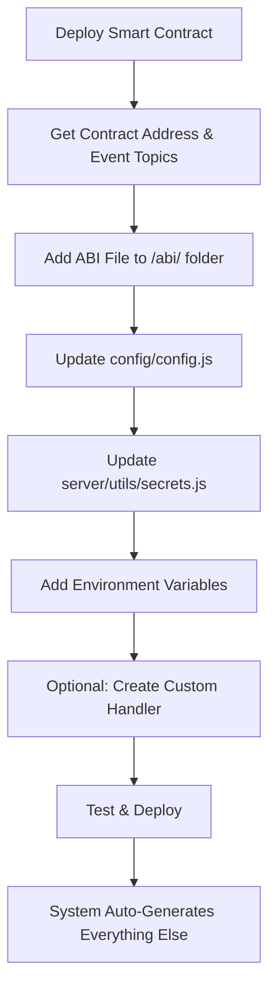

# 🚀 Multi-Chain Blockchain Event Listener

## 📋 Project Overview

This is a **multi-chain blockchain event listener** that monitors ERC-20 token **transfer events** across different blockchain networks. The system includes features for **transfer event processing**, **gap detection**, **race condition handling**, and **token database integration**.

### ✨ Key Features

- 🌐 **Multi-Chain Support**: Deploy on multiple chains using the same Redis instance
- 🔄 **Dual-Track Processing**: Real-time priority with background historical processing
- 🚀 **Optimized Batch Processing**: 100-block batches for reliable API responses
- 📊 **Redis State Management**: Separate databases per chain with dual tracking
- 💰 **Token Database Integration**: Filter transfer events against stored token collections
- 🎯 **Configuration-Driven**: Add/remove transfer contracts without code changes
- ⚡ **Memory Optimized**: Chunked processing prevents memory explosions
- 🛡️ **Production Resilient**: Automatic fallbacks and circuit breakers
- 🔐 **Checksum Address Validation**: EIP-55 compliant address handling

### 🌐 Multi-Chain Deployment Strategy

**Perfect for scaling across multiple blockchains:**

```bash
# Ethereum Deployment (CHAIN_ID=1) → Redis DB 0
Keys: realtime_processed_block, historical_processed_block, historical_range

# Base Deployment (CHAIN_ID=8453) → Redis DB 1  
Keys: realtime_processed_block, historical_processed_block, historical_range

# Polygon Deployment (CHAIN_ID=137) → Redis DB 2
Keys: realtime_processed_block, historical_processed_block, historical_range
```

**✅ Same Redis Instance, Complete Isolation**: Each chain uses separate Redis databases, preventing any conflicts.

## 💰 Token Database Integration

### 🎯 Smart Transfer Event Filtering

The event listener now includes **intelligent token filtering** that only processes transfer events for tokens stored in your database. This prevents unnecessary processing of unrelated ERC-20 transfer events while maintaining full compatibility with existing systems.

#### **How It Works:**
```javascript
// 1. Load tracked tokens from MongoDB
const trackedTokens = await loadTokenAddresses(); // Cached for 5 minutes

// 2. Check if transfer event is for a tracked token
const eventAddress = log.address;
const isTracked = await isTrackedToken(eventAddress);

// 3. Process only relevant transfers
if (isTracked) {
    await processTransferEvent(eventData); // Send to SQS
} else {
    console.log(`⏭️ Skipping untracked token: ${eventAddressChecksum}`);
}
```

#### **Database Schema:**
```javascript
const tokenSchema = new mongoose.Schema({
    address: {
        type: String,
        required: true,
        unique: true // Checksum format (EIP-55)
    },
    name: { type: String, required: true },
    symbol: { type: String, required: true, uppercase: true },
    decimals: { type: Number, required: true, min: 0, max: 18 },
    chainId: { type: Number, required: true }
}, { timestamps: true });
```

#### **Benefits:**
- 🎯 **Reduced Noise**: Only process relevant token transfers
- 🚀 **Performance**: Skip untracked tokens automatically
- 📊 **Analytics**: Focus on your token ecosystem
- 🔄 **Dynamic**: Add/remove tracked tokens without restart

## 🛠️ Redis Management Commands

### 📊 **Essential Commands**

#### **1. View Current State:**
```bash
# Start Redis CLI and select your chain database
redis-cli

# For Base Chain (most common)
SELECT 1
HGETALL realtime_processed_block
KEYS *

# For Ethereum Chain  
SELECT 0
HGETALL realtime_processed_block
KEYS *
```

#### **2. Test Historical Processing (Large Gap):**
```bash
# Start Redis CLI
redis-cli

# Set old block to create large gap for testing
SELECT 1
HSET realtime_processed_block block 35500000 chain 8453 updated 1758649000000 service base_mainnet type realtime
DEL historical_processed_block historical_range

# Verify setup
HGETALL realtime_processed_block
```

#### **3. Reset System (Clean Start):**
```bash
# Start Redis CLI
redis-cli

# Clear all data for Base chain
SELECT 1
FLUSHDB

# Or clear all databases
FLUSHALL
```

### 🎯 **Database Mapping:**
```bash
SELECT 0  # Ethereum (Chain ID: 1)
SELECT 1  # Base (Chain ID: 8453)  
SELECT 2  # Polygon (Chain ID: 137)
```

### ⚡ **Performance Configuration**

#### **Current Optimized Settings:**
```bash
Batch Size: 100 blocks (all chains)
Chunk Size: 1000 logs per chunk
API Response: ~10-40MB (safe for all providers)
Performance: 100x faster than individual calls
Memory: Optimized with chunked processing
```

## 🔧 Smart Contract Development Guide

### 📋 Overview: How Contract Support Works

The event listener uses a **configuration-driven architecture** where adding/removing smart contracts requires **zero code changes** to the core system. Everything is controlled through configuration files.

**🎯 High-Level Process:**
1. **Contract Deployment** → Get contract address and event topics
2. **Configuration Update** → Add contract details to config files  
3. **Environment Setup** → Add addresses and topics to environment
4. **Automatic Integration** → System auto-generates event handlers and registry

### 🏗️ Supported Contract Types

The event listener supports ERC-20 token contracts with transfer event monitoring:

| Contract Type | Use Case | Handler Type | SQS Queue |
|---------------|----------|--------------|-----------|

| **ERC-20 Transfer Monitoring** | ERC-20 token transfer events | `handleTransferEvent` | `TRANSFER_HANDLER_SQS` |


---

## 🚀 Adding New Smart Contract Support

### 📊 **High-Level Development Workflow**



### 🔧 **Step-by-Step Implementation**

#### **Step 1: Prepare Contract Information**

Before starting, gather:
- ✅ **Contract Address** (deployed on target chain)
- ✅ **Event Topics** (keccak256 hash of event signatures)
- ✅ **Contract ABI** (JSON file from compilation)
- ✅ **Event Names** (exact names from Solidity contract)

**Example ERC-20 Contract:**
```solidity
contract MyERC20Token {
    event Transfer(address indexed from, address indexed to, uint256 value);
}
```

**Transfer Event Topic:**
```bash
# Standard ERC-20 Transfer event topic (same for all ERC-20 tokens)
Transfer(address,address,uint256): 0xddf252ad1be2c89b69c2b068fc378daa952ba7f163c4a11628f55a4df523b3ef
```

#### **Step 2: Add ABI File**

```bash
# 1. Copy your contract ABI to the abi folder
cp MyTokenContract.json abi/MyTokenContract.json
```

**ERC-20 ABI File Structure:**
```json
{
  "abi": [
    {
      "anonymous": false,
      "inputs": [
        {"indexed": true, "name": "from", "type": "address"},
        {"indexed": true, "name": "to", "type": "address"},
        {"indexed": false, "name": "value", "type": "uint256"}
      ],
      "name": "Transfer",
      "type": "event"
    }
  ]
}
```

#### **Step 3: Update Configuration (`config/config.js`)**

```javascript
// 1. Add ABI import at the top
const { abi: MyERC20Abi } = require('../abi/MyERC20Token.json');

// 2. Add contract to CONTRACT_CONFIG array
{
    name: 'My ERC-20 Token',
    events: [
        {
            topic: () => Secrets.TRANSFER_TOPIC,
            eventName: 'Transfer',
            abi: MyERC20Abi,
            handler: 'handleTransferEvent'
        }
    ]
}
```

#### **Step 4: Add Environment Variables (`server/utils/secrets.js`)**

```javascript
// Add to ISecrets object (around line 68)
const ISecrets = {
    // ... existing variables ...
    MY_ERC20_ADDRESS: null,
    // ... rest of variables ...
};
```

#### **Step 5: Set Environment Variables**

```bash
# Add to your .env file or environment
MY_ERC20_ADDRESS=0x1234567890abcdef1234567890abcdef12345678
```

#### **Step 6: Optional - Create Custom Transfer Handler (`server/utils/utils.js`)**

**For standard ERC-20 transfers, use the existing handler:**

- `handleTransferEvent` → Sends to `TRANSFER_HANDLER_SQS`

**For custom transfer processing, create a specialized handler:**

```javascript
// 1. Add to getHandlerFunction() handlers object
const handlers = {
    // ... existing handlers ...
    handleMyERC20Transfer: (log) => handleMyERC20Transfer(log),
};

// 2. Add custom transfer handler function
async function handleMyERC20Transfer(log) {
    const decodedLog = await decodeLog(log);
    if (decodedLog && !decodedLog.error) {
        const eventData = await transformSubscriptionEvents(
            decodedLog,
            log,
            decodedLog.eventName
        );

        // Custom transfer processing logic
        if (eventData.eventType === 'Transfer') {
            // Add custom transfer logic
            eventData.customField = 'erc20_transfer_processed';
            eventData.tokenAddress = log.address;
        }

        await processTransferEvent(eventData);
    }
}

// 3. Export the function
module.exports = {
    // ... existing exports ...
    handleMyERC20Transfer,
};
```

#### **Step 7: Add Custom Event Transformer (if needed)**

```javascript
// In transformSubscriptionEvents function, add new case
switch (eType) {
    // ... existing cases ...

    case 'Transfer': {
        jsonData = await myTokenEventHandler(decodedEvent, eType, jsonData);
        break;
    }
}

// Add transformer function
async function myTokenEventHandler(decodedEvent, eType, jsonData) {
    const expectedFields = ['from', 'to', 'value'];
    const hasAllFields = expectedFields.every(
        (field) => field in decodedEvent.decodedParameters
    );

    if (!hasAllFields) {
        console.error('Error: Missing fields in decoded parameters for', eType);
        return null;
    }

    jsonData.events[eType] = {
        from: decodedEvent.decodedParameters.from,
        to: decodedEvent.decodedParameters.to,
        value: decodedEvent.decodedParameters.value.toString()
    };

    return jsonData;
}
```

#### **Step 8: Test & Deploy**

```bash
# 1. Test configuration syntax
node -c config/config.js
node -c server/utils/secrets.js
node -c server/utils/utils.js

# 2. Start in development mode
npm run dev

# 3. Check startup logs for your contract

# 4. Test with a transaction on your contract
# 5. Verify event data in SQS queue
```

---

## 🗑️ Removing Smart Contract Support

### 🔧 **Quick Removal (Temporary)**

**Just comment out the contract in `config/config.js`:**

```javascript
// Temporarily disable contract
/*
{
    name: 'Contract To Remove',
    address: () => Secrets.CONTRACT_ADDRESS,
    events: [...]
}
*/
```

**Result:** System skips the contract, continues with others.

### 🧹 **Complete Removal (Permanent)**

#### **Step 1: Remove from Configuration**
```javascript
// Delete entire contract block from CONTRACT_CONFIG array in config/config.js
```

#### **Step 2: Remove ABI Import**
```javascript
// Remove or comment out ABI import
// const { abi: ContractAbi } = require('../abi/Contract.json');
```

#### **Step 3: Clean Environment Variables**
```javascript
// Remove from ISecrets in server/utils/secrets.js
// CONTRACT_ADDRESS: null,
// CONTRACT_TOPIC: null,
```

#### **Step 4: Remove Custom Handlers (if any)**
```javascript
// Remove custom handler functions from server/utils/utils.js
// Remove from handlers object in getHandlerFunction()
// Remove custom transformer functions
```

#### **Step 5: Clean Environment**
```bash
# Remove from .env file
# CONTRACT_ADDRESS=...
# CONTRACT_TOPIC=...
```

---

## 🔍 **Debugging & Troubleshooting**

### **Common Issues & Solutions**

| Issue | Cause | Solution |
|-------|-------|----------|
| Contract not showing in logs | Missing address in env | Check environment variables |
| Events not being processed | Wrong event topic | Verify topic hash calculation |
| ABI decode errors | Mismatched ABI | Update ABI file from latest contract |
| Handler not found | Typo in handler name | Check handler name in config |
| SQS errors | Wrong queue URL | Verify SQS queue configuration |

### **Verification Commands**

```bash
# Check contract configuration
node -e "console.log(require('./config/config').CONTRACT_CONFIG)"

# Test environment variables
node -e "console.log(require('./server/utils/secrets').Secrets)"

# Verify event topics
node -e "console.log(require('web3').utils.keccak256('EventName(address,uint256)'))"

# Check Redis state
redis-cli keys "chain:*"
redis-cli hgetall "chain:1:progress"
```

### **Development Best Practices**

1. **✅ Always test on testnet first**
2. **✅ Use existing handlers when possible**  
3. **✅ Follow naming conventions** (`CONTRACT_ADDRESS`, `EVENT_TOPIC`)
4. **✅ Add comprehensive error handling**
5. **✅ Document custom event structures**
6. **✅ Test with multiple event scenarios**
7. **✅ Monitor SQS queues during testing**

---

## 🏗️ Architecture & Performance

### 🎯 Intelligent Block Processing

```javascript
// Real-time Priority + Background Catch-up
Gap = 0 blocks     → Process immediately
Gap = 1-5 blocks   → Fill gap immediately, then process new block  
Gap = 6+ blocks    → Process new block first, background catch-up
```

### 🚀 Race Condition Prevention

**Problem**: Multiple processes trying to process the same block
**Solution**: Atomic Redis claims using `SET ... NX`

```javascript
// Only ONE process can claim each block
const claimed = await claimBlockForProcessing(blockNumber);
if (!claimed) {
    console.log('Block already claimed by another process');
    return; // Skip gracefully
}
```

### ⚡ Chain-Specific Optimization

```javascript
const CHAIN_CONFIG = {
    batchSizes: {
        1: 3,      // Ethereum (12.04s blocks) - Conservative
        137: 15,   // Polygon (2.14s blocks) - Moderate  
        8453: 10,  // Base (2s blocks) - Moderate
        25: 25     // Cronos (0.56s blocks) - Aggressive
    },
    delays: {
        1: 300,    // Ethereum - Longer delay (expensive RPC)
        137: 100,  // Polygon - Medium delay
        8453: 150, // Base - Medium delay  
        25: 50     // Cronos - Short delay (fast blocks)
    }
};
```

### 📊 Redis State Management

**100% Redis-based with zero memory storage:**

```bash
# Progress Tracking
chain:1:progress              → Last processed block metadata

# Duplicate Prevention  
chain:1:block:18500000        → Block processed marker (24h TTL)

# Race Prevention
chain:1:claim:18500001        → Processing claim lock (5min TTL)
```

## 🚀 Multi-Chain Deployment

### Environment Configuration Examples

#### Ethereum Mainnet:
```bash
CHAIN_ID=1
WEB3_PROVIDER=wss://eth-mainnet.g.alchemy.com/v2/your-api-key
LAST_PROCESSED_BLOCK_KEY=ethereum_mainnet

# Contract addresses for Ethereum
```

#### Base Mainnet:
```bash
CHAIN_ID=8453
WEB3_PROVIDER=wss://base-mainnet.g.alchemy.com/v2/your-api-key  
LAST_PROCESSED_BLOCK_KEY=base_mainnet

```

#### Polygon Mainnet:
```bash
CHAIN_ID=137
WEB3_PROVIDER=wss://polygon-mainnet.g.alchemy.com/v2/your-api-key
LAST_PROCESSED_BLOCK_KEY=polygon_mainnet

# Contract addresses for Polygon
```

### 📁 Project Structure

```
base_event_listener/
├── 📁 config/
│   ├── 🎯 config.js              ← MAIN CONFIGURATION (add/remove contracts here)
│   ├── 🔗 redisInstance.js       ← Redis connection & retry logic
│   ├── 🌐 web3Instance.js        ← WebSocket connection & auto-reconnect
│   └── 🗄️ mongooseInstance.js    ← MongoDB connection & configuration
├── 📁 models/
│   └── 💰 token.js               ← Token database model (checksum addresses)
├── 📁 server/
│   ├── 🚀 manager.js             ← Core event processing & gap detection
│   └── 📁 utils/
│       ├── 🛠️ utils.js           ← Event handlers & token filtering
│       ├── 🔐 secrets.js         ← Environment variable definitions
│       └── 📊 redisBlockStorage.js ← Redis state & race condition prevention
├── 📁 abi/                       ← Contract ABI JSON files
├── 📁 kubernetes/                ← K8s deployment configs
├── 🐳 Dockerfile                 ← Container configuration
├── 📋 package.json               ← Dependencies & scripts
├── 📄 .env.example               ← Environment variables template
└── 📖 README.md                  ← This documentation
```

### 🎯 Configuration-Driven Architecture

#### **Single Source of Truth**: `config/config.js`
- **CONTRACT_CONFIG**: All contract definitions
- **CHAIN_CONFIG**: Chain-specific settings (batch sizes, delays)
- **APP_CONFIG**: Application settings (file names, cache size)

#### **Dynamic Generation**:
- ✅ **Event Registry**: Auto-built from CONTRACT_CONFIG
- ✅ **ABI Mapping**: Auto-created from contract events
- ✅ **Token Filtering**: Auto-loaded from MongoDB with caching
- ✅ **Logging**: Auto-generated from active contracts
- ✅ **Chain Optimization**: Auto-selected based on CHAIN_ID

#### **Benefits**:
- 🎯 **Easy Contract Management**: Add/remove in one file
- 🚀 **Zero Code Changes**: Configuration drives everything
- 🔧 **Dynamic Handlers**: Handler functions selected by name
- 📊 **Chain Optimization**: Automatic batch/delay selection


### ⚡ Installation & Setup

#### **1. Clone & Install**
```bash
# Clone the repository
git clone git@github.com:Alethea-FullStack/HIVE_listener.git
cd HIVE_listener

# Install dependencies
npm install
```

#### **2. Environment Configuration**
```bash
# Copy example environment file
cp .env.example .env

# Edit with your configuration (MongoDB optional for token filtering)
nano .env

# Note: If MONGODB_URI is not set, token filtering will be disabled
# but the event listener will still work normally
```

#### **3. Start Development**
```bash
# Development mode (with auto-restart)
npm run dev

# Production mode
npm start

# Check health
curl http://localhost:3001/health
```

#### **4. Verify Setup**
```bash
# Check startup logs for active contracts
=== ACTIVE CONTRACT CONFIGURATION ===
✅  Transfers: 0x2F41...
✅  Transfers: 0xa633...
✅ Token Database Filtering: Enabled (150 tokens tracked)
======================================

# Check Redis connection
redis-cli ping
# Should return: PONG

# Monitor block processing
tail -f logs/app.log | grep "New Block Mined"
```

### Required Environment Variables

```bash
# Core Configuration
CHAIN_ID=1                                    # 1=Ethereum, 8453=Base, 137=Polygon, 25=Cronos
WEB3_PROVIDER=wss://eth-mainnet.g.alchemy.com/v2/your-api-key
REDIS_URL=redis://localhost:6379
LAST_PROCESSED_BLOCK_KEY=ethereum_mainnet

# Database Configuration (for token filtering)
MONGODB_URI=mongodb://localhost:27017/
# MONGO_URI=mongodb://localhost:27017/  # Alternative

# AWS Configuration
AWS_SECRET_NAME=your-secret-name
AWS_REGION=us-east-2

# SQS Queues
TRANSFER_HANDLER_SQS=https://sqs.us-east-2.amazonaws.com/your-transfer-queue

# Monitoring
SENTRY_DSN=https://your-sentry-dsn@sentry.io/project-id
PORT=3001


# Event Topics (Same across chains)

# Transfer Monitoring
TRANSFER_TOPIC=0xddf252ad1be2c89b69c2b068fc378daa952ba7f163c4a11628f55a4df523b3ef
```

## 📊 Event Structure Examples

### ERC20 Transfer Events

#### Standard Transfer Event Structure
```json
{
	"eventType": "Transfer",
	"contractAddress": "0xA0b86a33E6441d4ea98f9Ad6241A5b6b3b4b4b4b",
	"chainId": 1,
	"transactionHash": "0x8ba1f109551bD432803012645821dcE2f5b7b7b7b7b7b7b7b7b7b7b7b7b7b7b7b",
	"events": {
		"Transfer": {
			"from": "0x742d35Cc6634C0532925a3b8b6b0b0b0b0b0b0b0",
			"to": "0x8ba1f109551bD432803012645821dcE2f5b7b7b7",
			"value": "1000000000000000000"
		}
	}
}
```

#### Transfer Event Fields
- **from**: Address sending the tokens (checksum format)
- **to**: Address receiving the tokens (checksum format)
- **value**: Amount of tokens transferred (as string to handle large numbers)

## 🛠️ Redis Management

### View Current State
```bash
# Check last processed block
redis-cli hgetall "chain:1:progress"

# Check if specific block was processed
redis-cli exists "chain:1:block:18500000"

# View all chain keys
redis-cli keys "chain:1:*"
```

### Set Block Number Manually
```bash
# Set last processed block
redis-cli hset "chain:1:progress" block 18500000 chain 1 updated $(date +%s000) service "ethereum_mainnet"

# For different chains
redis-cli hset "chain:8453:progress" block 8000000 chain 8453 updated $(date +%s000) service "base_mainnet"
```

## 🔧 Production Deployment

### PM2 Configuration
```javascript
// ecosystem.config.js
module.exports = {
  apps: [
    {
      name: 'ethereum-listener',
      script: 'index.js',
      env: {
        NODE_ENV: 'production',
        CHAIN_ID: '1',
        LAST_PROCESSED_BLOCK_KEY: 'ethereum_mainnet'
      }
    },
    {
      name: 'base-listener', 
      script: 'index.js',
      env: {
        NODE_ENV: 'production',
        CHAIN_ID: '8453',
        LAST_PROCESSED_BLOCK_KEY: 'base_mainnet'
      }
    }
  ]
};
```

### Docker Configuration
```dockerfile
FROM node:18-alpine
WORKDIR /app
COPY package*.json ./
RUN npm ci --only=production
COPY . .
EXPOSE 3001
CMD ["npm", "start"]
```

## 🎯 System Architecture

### Flow Diagram
```
┌─────────────────┐    ┌──────────────────┐    ┌─────────────────┐
│   Blockchain    │───▶│  Event Listener  │───▶│   SQS Queues    │
│   (Ethereum,    │    │                  │    │                 │
│    Base, etc.)  │    │ ┌──────────────┐ │    │ ┌─────────────┐ │
└─────────────────┘    │ │ Gap Detection│ │    │ │ Transfer Events │ │
                       │ │ & Processing │ │    │ │ ERC20 Transfers │ │
┌─────────────────┐    │ └──────────────┘ │    │ │              │ │
│      Redis      │◀──▶│                  │    │ └─────────────┘ │
│                 │    │ ┌──────────────┐ │    └─────────────────┘
│ ┌─────────────┐ │    │ │ Race Condition│ │
│ │ Block State │ │    │ │  Prevention   │ │
│ │ Duplicate   │ │    │ └──────────────┘ │
│ │ Prevention  │ │    └──────────────────┘
│ └─────────────┘ │
└─────────────────┘
```

